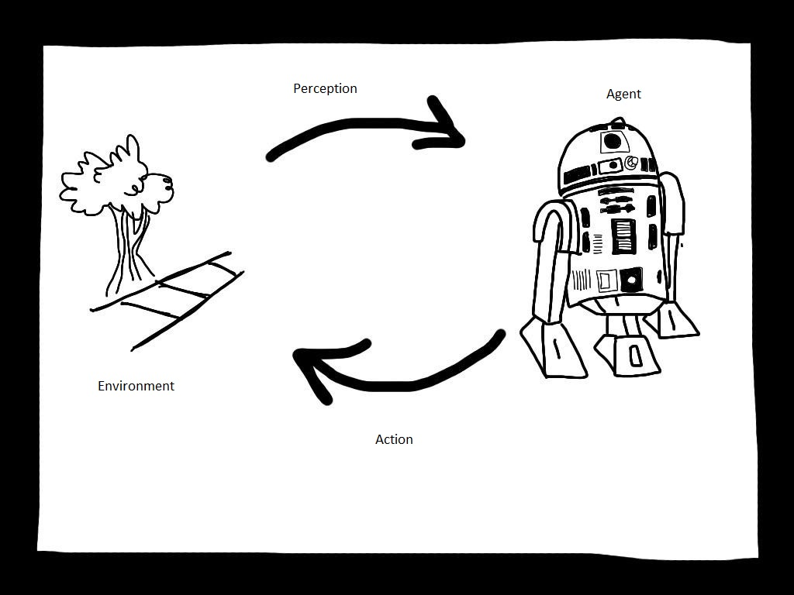

Probability theory is the analysis of random phenomena. It is a way of expressing the likelihood of events. This is important in artificial intelligence, as the world is a very uncertain and unpredictable place. This chapter will take a look at agents, uncertainty, probability and Bayes rule. Most of this content is from the book [Artificial Intelligence: A Modern Approach](http://aima.cs.berkeley.edu/) by Russell & Norvig.

## Rational Agents & Environments

An artificial intelligence is a machine that attempts to replicate how the human brain thinks and acts. These machines are traditionally called agents. These agents all exist in an environment, whether that be physical or imaginary. Rational agents choose actions that maximise performance given the environment they exist in. These agents produce the actions based on a set of inputs. 

Russell & Norvig (2009) came up with seven ways of classifying the environments agents can exist in:

- **Deterministic/Stochastic** - is the next state in the environment predictable given the knowledge of the previous state?
- **Static/Dynamic** - does the environment change while the agent is thinking?
- **Fully observable/Partially observable** - can the agent access all the information available in the environment?
- **Episodic/Sequential** - do current decisions affect future ones (sequential) or do actions taken in one episode not affect the actions in other episodes (episodic)?
- Single Agency/Multiple Agency - are there any other agents in the same environment?
- Known/Unknown - does the agent fully understand the laws and rules that govern the environment?
- Discrete/Continuous - are there fixed locations or time intervals?
- Simulated - is something else used to simulate the environment, evaluate performance, etc?

## Uncertainty

Uncertainty is the notion of imperfect information about the environment and actions. Probability theory provides a quantitative way of encoding uncertainty.

## Probability

This is the process of quantifying of the likeliness of an event to occur. Probability has a natural frequency interpretation; and is a relative frequency. This is just a fancy way of saying if something happens *k* times, 15% of the time action A is taken, 25% of the time action B is taken and 60% of the time action C is taken, the probability ditributions will be:

| A    | B    | C    |
| ---- | ---- | ---- |
| 0.15 | 0.25 | .6   |

Sample space is denoted as:

$$
\Omega
$$

It contains all possible values of a variable. A possible value (event, state, sample point) is denoted by:

$$
\omega \in \Omega
$$

Every probability in the distribution must add up to one, such that:

$$
\omega \in \Omega, 0 \leq P(\omega) \leq 1
$$

$$
\sum_{\omega \in \Omega}P(\omega) = 1
$$

### Random  Variables

The sample space for a stochastic trial is the set of all outcomes, a **random variable** represents this trial, and its domain is the sample space.

- outcomes for a stochastic trial *is considered* the sample space for trial
- trial *is represented by* random variable
- domain of random variable *is* sample space

### Propositions

Propositions, or assertions, are random values that are binary (or boolean). propositional random variables are represented with a capital letter.

$$

Cavity=true

$$

Propositions are usually represented with the following notation (note that the name is lower-case — the values are atomic) for true and false, respectively:

$$
cavity, \neg cavity
$$

A discrete random variable can use propositions to represent a series of events:

$$
\Omega = \{sunny,rain,cloudy,snow\}, Weather = sunny
$$

Propositions have two important logical operators for "and" and "or", respectively:

$$
A\wedge B, A\vee B
$$

### Probability Distribution

A probability distribution is how all possible valies of a random variable is represented. For example, The probability distribution of *A* with *n* values can be represented as:

$$
<P(A=a_1),\ldots,P(A=a_n)>
$$

and it must obey the rule that the sum of all probabilities equal one:

$$
\sum_{i=1}^nP(A=a_i) = 1
$$

Probability distributions are always represented as vectors; the order matters. This means that probability distributions can be transposed without any loss of information.

### Joint Probability Distribution

One may also want to find the probability given some arbitrary number of random variables. This is called the joint probability distribution, and is represented by:

$$
P(A_1,\ldots,A_k)
$$

Where there are *k* random variables.

If there are two binary random variables *Cavity* and *Toothache*, and the domain is *{true, false}*, then P(*Cavity*, *Toothache*) can be represented by:

|                | Toothache = true | Toothache = false |
| -------------- | ---------------- | ----------------- |
| Cavity = true  | 0.04             | 0.06              |
| Cavity = false | 0.01             | 0.89              |

These combinations are mutually exclusive and exhaustive.

Like probability distributions, joint probability distributions must also sum to 1.

$$
0.04+0.01+0.06+0.89=1
$$

Inferences about the random variables can also be made by looking at the table of joint probabilities.

$$
\begin{align}
P(Cavity=true)\\\\
& = P(Cavity=true, Toothache=true) + P(Cavity=true, Toothache=true)\\\\
& = 0.1
\end{align}
$$

$$
\begin{align}
P(Toothache=true)\\\\
& = P(Toothache=true, Cavity=true) + P(Toothache=true, Cavity=true)\\\\
& = 0.05
\end{align}
$$

### Conditional Probability

This is the probability of an event given some known events. The conditional probability of *A* given *B* is denoted as:

$$
P(A|B)={P(A,B)\over P(B)}\\\\
\text{if }P(B)\ne0\\\\
P(A,B) \text{ or } P(A\wedge B) \text{ is the joint probability of A and B}
$$

if

$$
A:\Omega\rightarrow\{a_1\ldots a_n\}
$$

then

$$
P(A=a_1|B)+\ldots+P(A=a_n|B) = 1
$$

### Inference Using Full Joint Distribution

We can also infer through enumeration. The probability of a proposition is the sum of probabilitys of the events in which the proposition hold true.

$$
\begin{align}
P(cavity\vee toothache) \\\\
& = 0.108+0.012+0.072+0.008+0.016+0.064\\\\
& = 0.28
\end{align}
$$

In this example, we sum the probabilities of *toothache* or *cavity*, plus the hidden variable, *Catch.*

$2^n$ probabilities are needed for binary variables; if we want to calculate a joint probability $P(x_1,\ldots ,x_n)$ by enumeration based on the joint probability distribution table. The number of probabilities needed to complete probabilistic reasoning by enumeration is exponential with respect to the number of variables. This makes reasoning based on the full joint distribution difficult to scale up to large domains with many variables.

### Normalisation

A normalisation constant is used to reduce any probability function to a probability density function with a total probability of one.
$$
\begin{align}
P(\neg cavity|toothache) = P(\neg cavity \wedge toothache) / P(toothache)\\\\
& =(0.016+0.064)/(0.108+0.012+0.016+0.064) = 0.08/2\\\\
&=0.4
\end{align}
$$

$$
\begin{align}
P(cavity|toothache) = P(cavity \wedge toothache) / P(toothache)\\\\
& =(0.108+0.012)/(0.108+0.012+0.016+0.064) = 0.08/2\\\\
&=0.6
\end{align}
$$

$$
\begin{align}
P(Cavity|toothache) \\\\
& = <P(\neg cavity|toothache), P(cavity|toothache)>\\\\
& = <P(\neg cavity\wedge toothache)/P(toothache), P(cavity\wedge toothache)/P(toothache)>\\\\
& = \alpha<P(\neg cavity\wedge toothache), P(cavity\wedge toothache)>\\\\
& = \alpha<0.016+0.064, 0.108+0.12>\\\\
& = \alpha<0.08, 0.12>\\\\
& = \alpha<0.4, 0.6>
\end{align}
$$

Because we know that P(*toothache*) is 0.2, *a* = 1/P(*toothache*)

### Independence

If you have two events, *A* and *B*, they are only independent if:

$$
P(A|B) = P(A)
$$

This means that:

$$
P(A,B) = P(A)P(B)
$$

Independence allows us to decompose the number of probabilities needed in inference.

### Conditional Independence

While with independence, it is possible to reduce the complexity of probabalistic reasoning by decomposing a joint distribution, in the real world absolute independence is rare. A more common approach is conditional independence. The size of the representation of the joint distribution is reduced from exponential to linear in most cases. *A* and *B* are conditionally independent given *C* if and only if:

$$
P(A|B, C) = P(A|C)
$$

Thus, if *A* and *B* are independent given *C*, we have:

$$
\begin{align}
P(A, B|C) \\\\
&=P(A,B,C)/P(C)\\\\
&=P(A|B, C)P(B|C)/P(C)\\\\
&=P(A|C)P(B|C)
\end{align}
$$

## Bayes' Rule

$$
P(A|B)={P(B|A)P(A)\over P(B)}
$$

The joint probability of P(*A*,*B*) does not need to be known, the posterier probability P(*A*|*B*) using the proir belief P(*A*) and P(*B*), and the likelihood P(*B*|*A*) can be calculated. More conditions can be added and the rule stays the same:

$$
P(A|B,E)={P(B|A,E)P(A|E)\over P(B|E)}
$$

Bayes' rule is most helpful in solving diagnoses-type problems. The process of arguing from effet to cause is what the rule is good for. It can be used to estimate the probability of causes given some effects.

### Naïve Bayes Model

If a cause directly influences *n* effects, and these effects are conditionally independent from each other given the cause, the full joint distribution becomes:

$$
\begin{align}
P(Cause, Effect_1,\ldots,Effect_n)\\\\
&=P(Effect_1,\ldots,Effect_n|Cause)P(Cause)\\\\
&=P(Cause)\prod_{i=1}^{n}P(Effect_i|Cause)
\end{align}
$$
